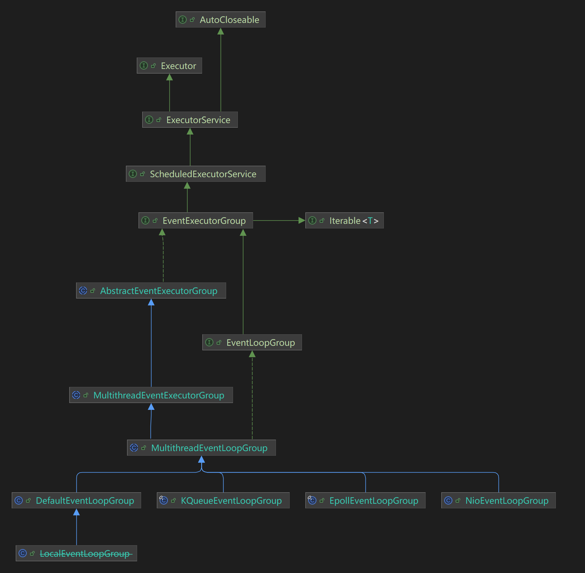

# 事件循环组的初始化

在服务端的代码中，我们创建了两个EventLoopGroup来分别处理连接请求和业务操作。

```java
EventLoopGroup bossGroup = new NioEventLoopGroup(1);
EventLoopGroup workerGroup = new NioEventLoopGroup();
```

首先看看该类型的继承关系



图 3.1 EventLoopGroup继承关系图

| 类型                          | 说明                                                         |
| ----------------------------- | ------------------------------------------------------------ |
| EventExecutorGroup            | **事件执行程序组接口**，扩展了`ScheduledExecutorService`并用于管理多个`EventExecutor`实例。 |
| EventLoopGroup                | **事件循环组接口**，特殊的`EventExecutorGroup`，它允许注册`Channel`，这些`Channel `在事件循环期间被处理以供以后选择。 |
| AbstractEventExecutorGroup    | **抽象事件执行程序组接口**，提供`EventExecutorGroup`的通用实现。 |
| MultithreadEventExecutorGroup |                                                              |
| MultithreadEventLoopGroup     |                                                              |
| DefaultEventLoopGroup         |                                                              |
| LocalEventLoopGroup           |                                                              |
| KQueueEventLoopGroup          |                                                              |
| EpollEventLoopGroup           |                                                              |
| NioEventLoopGroup             |                                                              |

